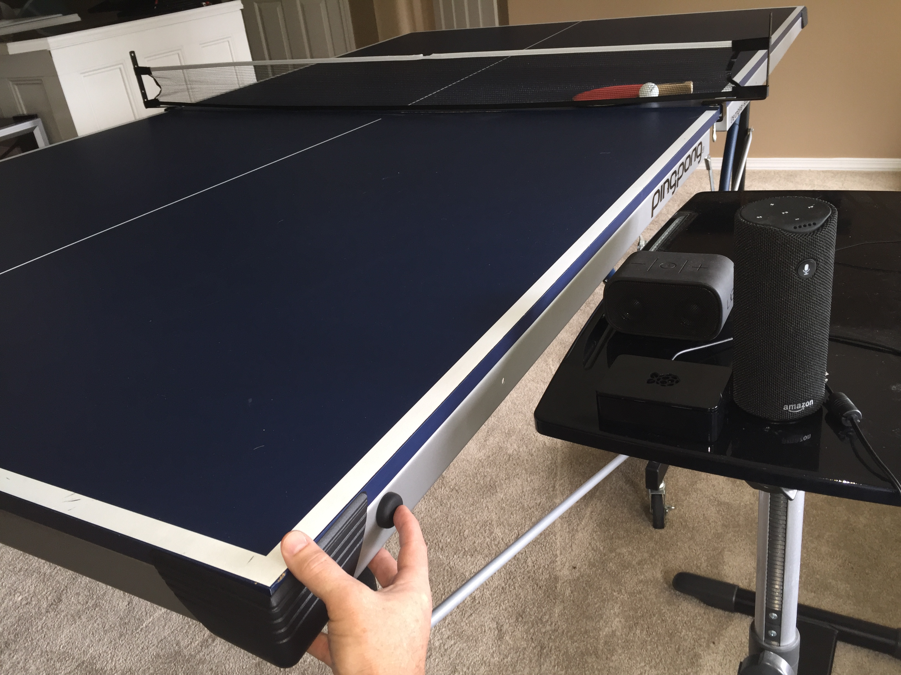

# Project: PingPong Showdown

## About the Project
This project is just a fun learning vehicle to develop skills around AWS, IoT and Alexa from Amazon. It uses both ASK and AVS to keep track of the score of a ping pong match. 
You begin a match by speaking to Alexa through an Echo or Tap, then when a player wins a point, you tap or double tap the Flic IoT button and Alexa will announce the new score. She may also throw in some sass for good measure. 

See [this guide](https://www.hackster.io/youngd/ping-pong-showdown-eabaed) for more information.

___

